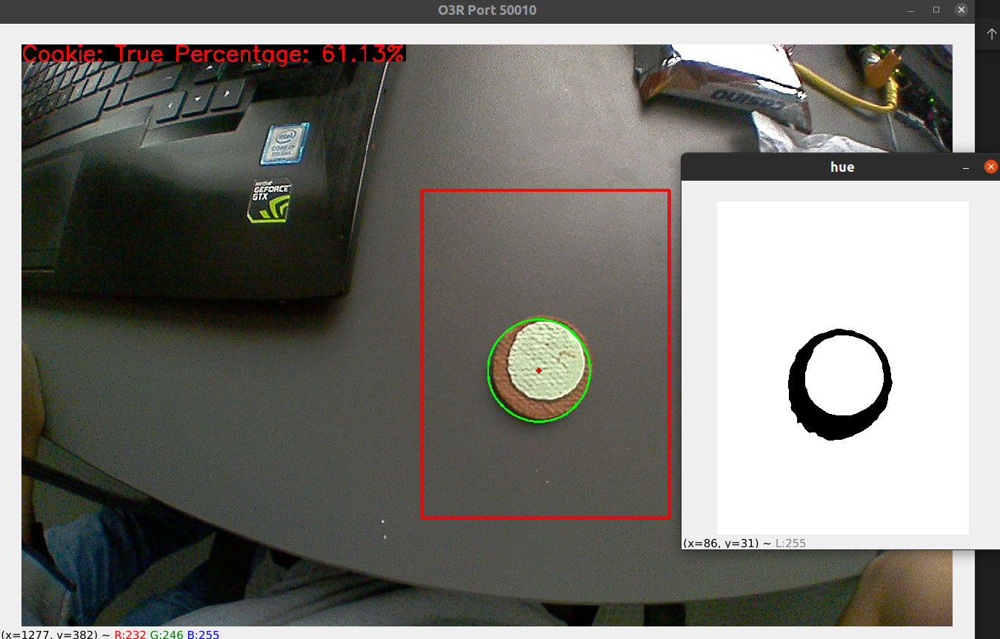

filling_detection
===

## Pasos de conexion y uso de OVP
- Antes de alimentar el OVP, conectar la o las camaras a utilizar.
- Alimentar el OVP y despues de unos segundos verificar que los leds de las camaras conectadss esten activados.
- Conectar el cable de ethernet a ETH0
- Colocar tu IP de ethernet a algo similar a la IP del OVP (por ejemplo: 192.168.0.100)

- Correr el archivo `activate_cameras.py` en la carpeta filling detection para activar el uso de los puertos que se han conectado (modificar si es necesario).

``` 
python3 activate_cameras.py
```

Para comprobar que se está recibiendo imagen del OVP, correr en la terminal la siguiente linea

``` 
python3 viewer.py --pcic-port 50010 --image jpeg
```
> El pci-port va de 50010 (port0) a 50015 (port5), tener en cuenta que los puertos 2D son los puertos 0 y 2, siendo el resto los puertos 3D.

## Pruebas con detección de círculos (rellenas)

> Esta aplicación ha sido utilizada con Python 3.8.10 y con las librerías especificadas en `requirements.txt`

Para la detección del relleno de galletas circulares se ha utilizado técnicas de procesamiento de imágenes en el espacio de color HSV (Hue, Saturation, and Value), donde se ha trabajdo con la capa de saturación pues brinda mayor información y contraste entre la galleta y la crema de relleno.

Para revisar el funcionamiento correcto, correr la siguiente línea en la terminal (es necesario ubicarnos en el folder `filling_detection` para poder correr el archivo). 

``` 
python3 test_circle.py
```

El resultado muestra una imagen de prueba, donde se podrá observar el porcentaje de relleno encontrado.

Para la detección en tiempo real, correr la siguiente línea

``` 
python3 live_circle_test.py --pcic-port 50010 --image jpeg
```

Con ello, se podrá ver en video el funcionamiento y detección de galletas.

A continuación mostramos algunos ejemplos obtenidos del live test




